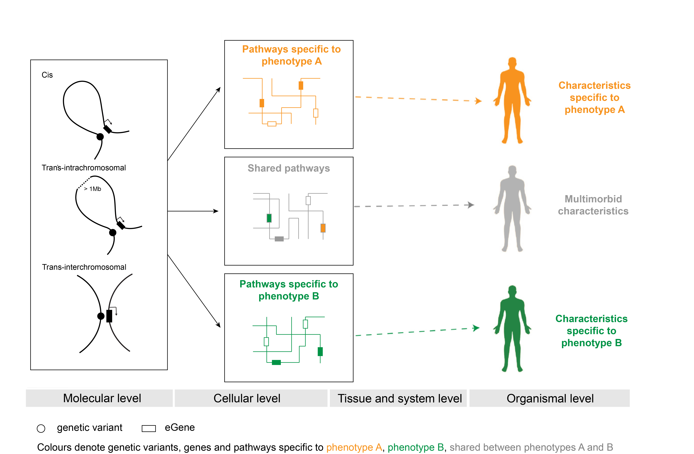

# GWAS SNPs impact shared regulatory pathways amongst multimorbid psychiatric disorders and cognitive functioning

This repository contains scripts, data, results, figures and reproducibility report for "GWAS SNPs impact shared regulatory pathways amongst multimorbid psychiatric disorders and cognitive functioning" study published in [Frontiers in Psychiatry](https://www.frontiersin.org/articles/10.3389/fpsyt.2020.560751/full). In this study, we integrated data on 3D genome organization and eQTLs to identify the tissue-specific spatial regulatory impacts of SNPs associated with cognitive functioning and five psychiatric disorders (i.e. attention-deficit hyperactivity disorder (ADHD), anxiety, bipolar disorder (BD), schizophrenia (SCZ) and unipolar depression (UD)). We hypothesized that this approach would enhance the discovery of shared characteristics (i.e. eGenes and biological pathways) among psychiatric and cognitive phenotypes, thereby potentially disclosing the mechanism for the p-factor that contributes to the observed multimorbidities.  

Python (version 2.7.15), R (version 3.5.2) and RStudio (version 1.1.463) were used for data processing, analysis and visualisation.  

1. Cell type- and tissue-specific Hi-C data is available on [GEO](https://www.ncbi.nlm.nih.gov/geo/) database (accessions: GSE63525, GSE35156, GSE43070, GSE77565, GSE105194, GSE105513, GSE105544, GSE52457, GSE105914, GSE105957, GSE87112).  
2. RNA-seq and genotyping data (GTEx v7) are available via [dbGaP](https://www.ncbi.nlm.nih.gov/gap/) access (accession: phs000424.v7.p2).  
3. Human genome build hg19 release 75 (GRCh37) (“Homo_sapiens.GRCh37.75.dna.primary_assembly.fa.gz”) was downloaded from ftp://ftp.ensembl.org/pub/release-75/fasta/homo_sapiens/dna/.  
4. SNP genomic positions were obtained from ftp://ftp.ncbi.nih.gov/snp/organisms/human_9606_b151_GRCh37p13/.  
5. Gene annotation for GENCODE v19 (“gencode.v19.transcripts.patched_contigs.gtf”) was downloaded from https://storage.googleapis.com/gtex_analysis_v7/reference/.  
6. SNPs associated with ADHD, anxiety, BD, UD, SCZ and cognitive functioning were downloaded from the [GWAS Catalog](www.ebi.ac.uk/gwas/) on 07/12/2018 and 14/07/2018.

Genetic model of multimorbidity and the SNP-phenotype relationship. Phenotype-specific genetic variants alter tissue-specific gene expression by changing regulatory connections within the 3D dimensional organization of the genome. The gene products, whose expression is altered, interact within biological pathways. Multimorbidity results when affected gene products co-occur within pathways. The co-occurrence of affected gene products within shared pathways changes the way pathways respond to environmental signals and thus affects cellular activities at tissue and system levels.
